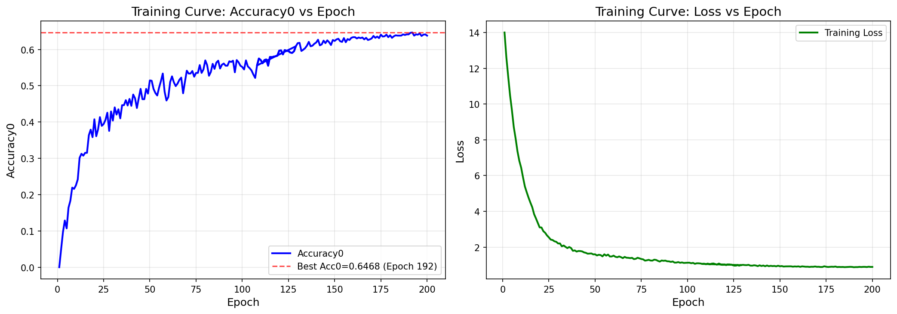

# 实验记录

## 实验 1: 默认配置基线

| 项目 | 详情 |
|------|------|
| **日期** | 2026-04-10 |
| **数据集** | dataset_D_ge3years_count (107个体, 2620训练图, 1194测试图) |
| **配置** | configs/config_turtle.yaml |

### 模型架构

| 组件 | 配置 |
|------|------|
| **输入分辨率** | 224×224 |
| **Backbone** | ResNet101 |
| **Bottleneck** | 多层 MLP (2048→1024→512) |
| **SE-Block** | 关闭 |
| **Dropout** | 0.4 |

### 训练参数

| 参数 | 值 |
|------|-----|
| batch_size | 16 |
| accumulation_steps | 4 |
| base_lr | 0.001 |
| backbone_lr | 0.0001 |
| weight_decay | 0.0005 |
| epochs | 30 |
| freeze_until_epoch | 10 |
| arcface_s | 30.0 |
| arcface_m | 0.4 |
| label_smoothing | 0.1 |

### 数据增强

| 增强 | 值 |
|------|-----|
| random_horizontal_flip | 0.5 |
| random_affine_degrees | 15 |
| color_jitter | brightness:0.3, contrast:0.3, saturation:0.2, hue:0.1 |
| gaussian_blur_kernel | 3 |
| random_erasing_p | 0.5 |

### 结果

| 指标 | 值 |
|------|-----|
| **Test Accuracy** | **86.61%** |

---

## 实验 2: GPU 优化配置（batch=128, 精简增强）

| 项目 | 详情 |
|------|------|
| **日期** | 2026-04-10 |
| **数据集** | dataset_D_ge3years_count |
| **目标** | 最大化 GPU 利用率 (100%) |

### 配置对比（vs 实验1）

| 参数 | 实验1 | 实验2 |
|------|-------|-------|
| batch_size | 16 | **128** |
| accumulation_steps | 4 | 1 |
| num_workers | 8 | 4 |
| color_jitter | 全开 | **仅 brightness** |
| random_affine | 15 | **0（关闭）** |
| random_erasing_p | 0.5 | **0（关闭）** |

### GPU 指标

| 指标 | 实验1 | 实验2 |
|------|-------|-------|
| GPU-Util | ~59% | **100%** |
| 显存 | ~6GB | **~11GB** |

### 结果

| 指标 | 实验1 | 实验2 | 变化 |
|------|-------|-------|------|
| **Test Accuracy** | 86.61% | **83.94%** | **↓ 2.67%** |

### 分析

- **下降原因**：过度减少数据增强导致模型泛化能力不足
- **教训**：GPU 利用率 100% 不代表效果好，需要在速度和增强之间平衡

---

## 实验 3: 平衡配置（batch=128, 适中增强）

| 项目 | 详情 |
|------|------|
| **日期** | 2026-04-10 |
| **数据集** | dataset_D_ge3years_count |
| **目标** | 平衡 GPU 利用率和数据增强强度 |

### 配置对比

| 参数 | 实验2 | 实验3 |
|------|-------|-------|
| batch_size | 128 | 128 |
| accumulation_steps | 1 | 1 |
| random_affine_degrees | 0 | **5** |
| color_jitter | 仅 brightness | **全开（轻量）** |
| random_erasing_p | 0 | **0.2** |

### 结果

| 指标 | 实验1 | 实验2 | 实验3 | 对比实验1 |
|------|-------|-------|-------|---------|
| **Test Accuracy** | **86.61%** | 83.94% | **84.63%** | **↓ 1.98%** |

### 分析

- 相比实验2（83.94%）**提升 0.69%**，说明恢复部分增强有效果
- 仍低于实验1（86.61%），说明 batch=128 可能对泛化有一定负面影响
- batch 越大，每个 epoch 的更新次数越少，模型学习步调更粗

### 结论

- batch=128 虽然 GPU 跑满，但泛化不如 batch=16
- **实验1 的配置仍然是最佳基线**

---

## 实验 4: 200 Epoch 长训练 + Acc0 指标（ResNet101, batch=128）

| 项目 | 详情 |
|------|------|
| **日期** | 2026-04-11 |
| **数据集** | dataset_D_ge3years_count (107个体, 2616训练图, 1158测试图) |
| **运行环境** | 云显卡 (RTX 4090) |

### 完整配置

#### 数据配置
```yaml
data:
  root_dir: "/workspace/Fuchuang/turtlehead-dataset/Turtel_dataset"
  splits_dir: "dataset_splits"
  dataset_name: "dataset_D_ge3years_count"
  image_size: 224
  num_workers: 16
  min_samples_per_identity: 5
```

#### 模型配置
```yaml
model:
  backbone: resnet101
  pretrained: true
  bottleneck_dim: 512
  use_mlp_bottleneck: true
  dropout: 0.4
  arcface_s: 30.0
  arcface_m: 0.35
  use_se_block: false
  label_smoothing: 0.1
```

#### 训练配置
```yaml
training:
  batch_size: 128
  accumulation_steps: 1
  epochs: 200
  freeze_until_epoch: 10
  optimizer: Adam
  base_lr: 0.002
  backbone_lr: 0.0002
  weight_decay: 0.0005
  scheduler: CosineAnnealingLR
  eta_min: 0.000001
  precision: 16
```

#### 数据增强配置
```yaml
augmentation:
  random_horizontal_flip: 0.5
  random_affine_degrees: 15
  color_jitter_brightness: 0.3
  color_jitter_contrast: 0.3
  color_jitter_saturation: 0.2
  color_jitter_hue: 0.1
  gaussian_blur_kernel: 3
  gaussian_blur_sigma: [0.1, 2.0]
  random_erasing_p: 0.5
  random_erasing_scale: [0.02, 0.15]
  random_erasing_ratio: [0.3, 3.3]
```

### 结果

| 指标 | 值 |
|------|-----|
| **最终 Acc0 (Epoch 222)** | **63.82%** |
| **最佳 Acc0 (Epoch ~180)** | **64.68%** |
| **最终 Acc (最近邻)** | **~85%** |
| 训练轮次 | 222 epochs |

### 训练曲线



### 关键发现

1. **Acc0 vs Acc 差异大**：Acc0=64.68%，Acc≈85%，说明直接分类头比最近邻特征匹配难
2. **Acc0 收敛慢**：约 150-180 epoch 达到峰值，之后略有下降（过拟合）
3. **学习率设置**：base_lr=0.002 比之前 0.001 高，初期学习更快
4. **ArcFace margin 调整**：m=0.35（之前 0.4），可能影响特征可分性

### 与实验 1 对比

| 参数 | 实验1 | 实验4 |
|------|-------|-------|
| batch_size | 16 | 128 |
| epochs | 30 | 200 |
| base_lr | 0.001 | 0.002 |
| backbone_lr | 0.0001 | 0.0002 |
| arcface_m | 0.4 | 0.35 |
| num_workers | 8 | 16 |
| 最佳指标 | Acc=86.61% | Acc0=64.68% |

### 分析

- **Acc0 是新指标**，与之前的 Acc 不可直接对比
- Acc0 衡量直接分类能力，Acc 衡量特征相似度
- Acc0=64.68% 说明分类头还有提升空间
- 后续需要优化分类头结构或调整 ArcFace 参数

---

## 后续优化计划

1. 使用 Optuna 搜索超参数组合（学习率、batch_size、dropout、arcface_m 等）
2. 预期目标：Test Accuracy ≥ 88%
3. Optuna 配置：`configs/config_optuna.yaml`
4. 运行方式：`python optimize.py --config configs/config_optuna.yaml --n-trials 50`
